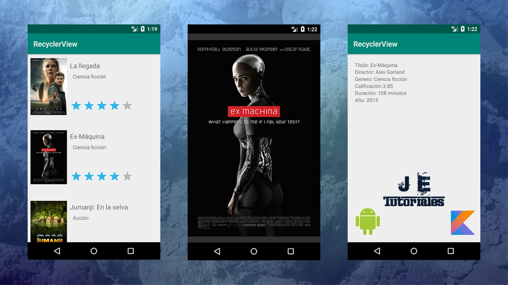

# Lista Personalizada con RecyclerView

Ejemplo de cómo crear una lista personalizada con el elemento RecyclerView, explicación detallada del código:   [https://youtu.be/JPi-LHE1Tbc](https://youtu.be/JPi-LHE1Tbc)

